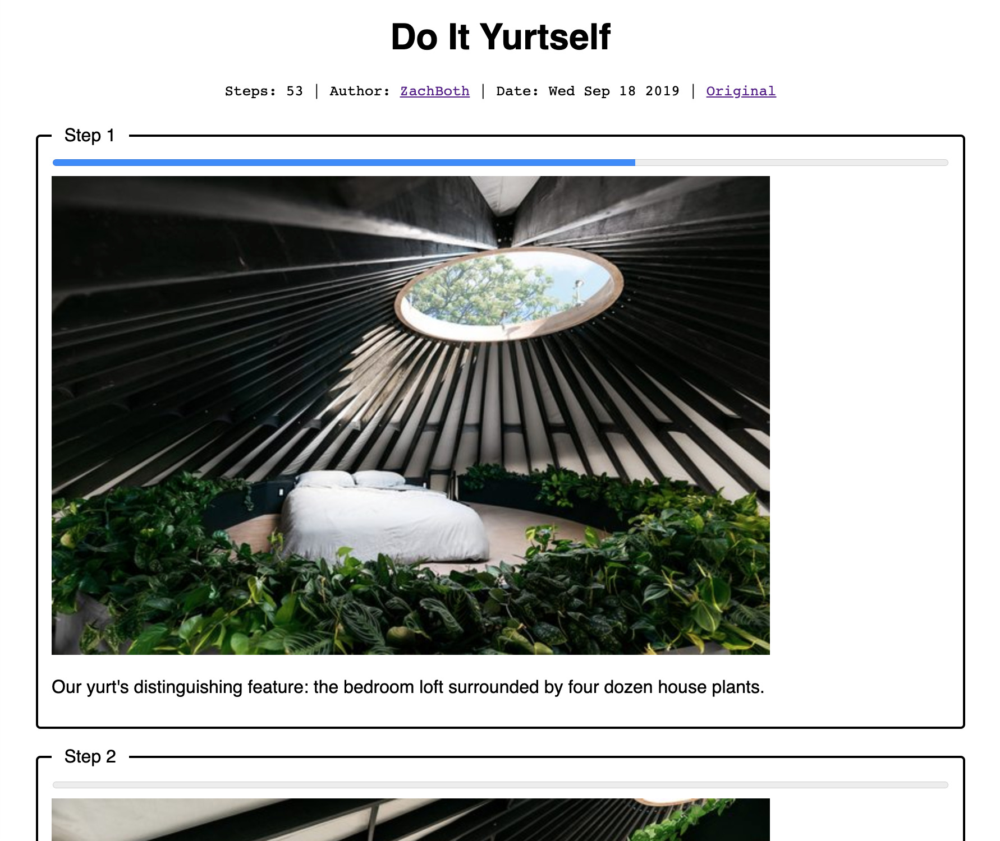
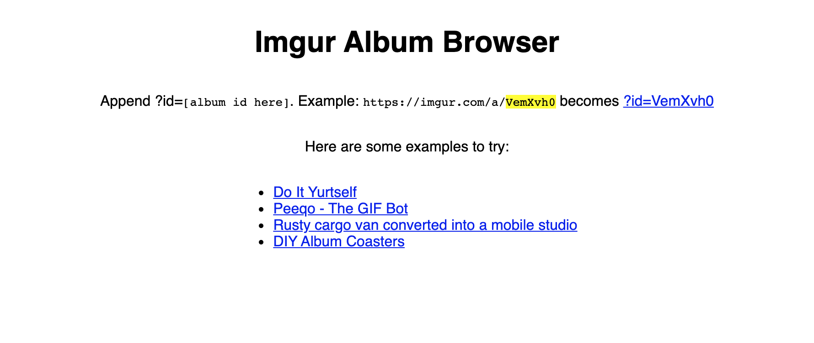

# Imgur Album Browser

A tool to simplify browsing Imgur albums. I use it mainly to follow step-by-step tutorials on Imgur.

More information in [this blog post](https://mhasbini.com/blog/imgur-album-browser.html).

# Usage

Demo: https://mhasbini.com/miscs/imgur-album-browser/index.html

- Follow registration process on [Imgur docs](https://apidocs.imgur.com/?version=latest)
- Open `get_album_data.js` and replace `CLIENT_ID` with the id you got.
- Open `index.html`.

## Screenshots
In Action               | Home Page
:-------------------------:|:-------------------------:
| 
